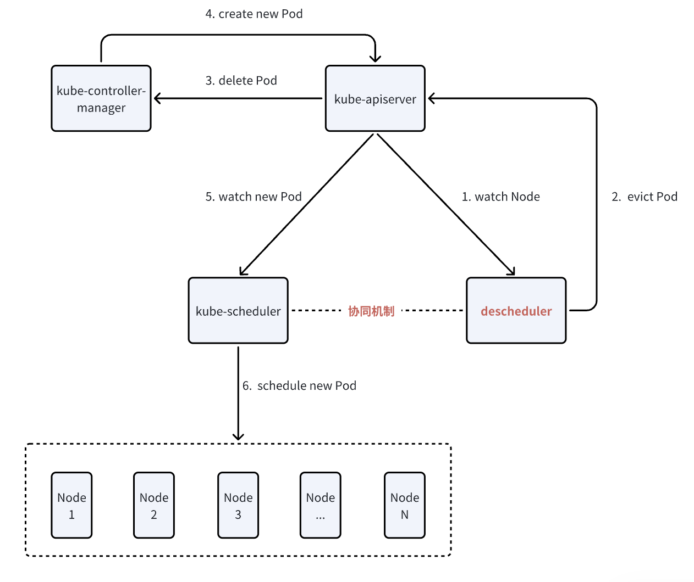
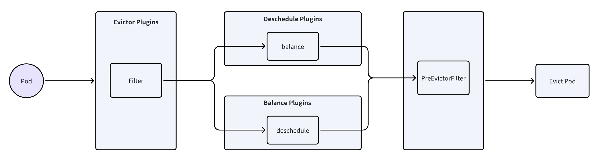
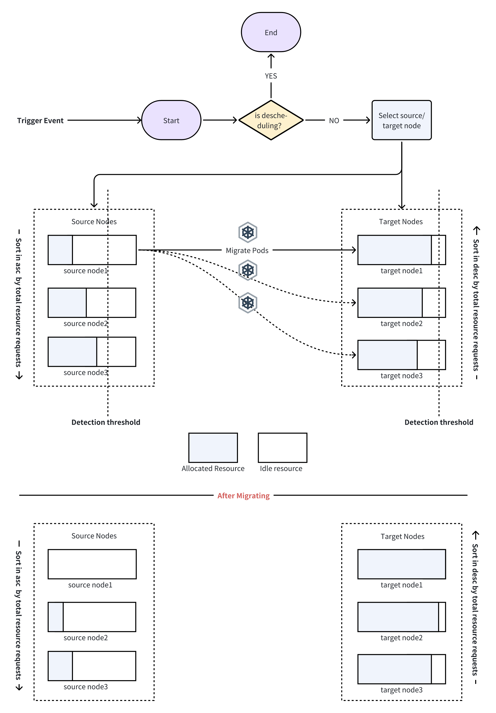

# Coordinate descheduler and Volcano to support resource defragmentation

## Background
Volcano, as a batch job scheduling engine for Kubernetes, provides core value by optimizing resource utilization for large-scale computing tasks. The existing Volcano descheduler supports load-aware rescheduling (migrating Pods based on actual node loads), but it lacks the capability to proactively consolidate resource fragmentation.
Resource fragmentation refers to the presence of numerous small, scattered free resources in the cluster, which are insufficient to meet the resource demands of larger Pods. This results in low overall resource utilization.

Resource utilization and load balancing are key concerns for users, both of which heavily depend on the scheduler's capabilities. While Volcano currently offers stable scheduling, its scheduling process is typically static, whereas node resources change dynamically. Therefore, rescheduling is necessary, and the scheduler must collaborate effectively to optimize resource usage and meet users' expectations for resource efficiency and load balancing.

### 1.1 Current Deficiencies
* Lack of Fragmentation Detection: The existing descheduler cannot identify resource wastage caused by fragmentation, nor does it include an algorithm for detecting fragmented resources.
* Decoupled Eviction and Scheduling: The descheduler evicts Pods without coordinating with the scheduler, potentially leading to inconsistencies in scheduling policies, which may prevent evicted Pods from being rescheduled successfully.

## Solution


### 2.0 Prerequisite
The workflow of the Descheduler component is as follows:


The K8S Deschedule mechanism is implemented through plugins, which are divided into three categories:
```go
// pkg/descheduler/framework/types.go
type Plugin interface {
    Name() string
}

type DeschedulePlugin interface {
    Plugin
    Deschedule(ctx context.Context, nodes []*corev1.Node) *Status
}

type BalancePlugin interface {
    Plugin
    Balance(ctx context.Context, nodes []*corev1.Node) *Status
}
```
* Deschedule Plugins: Deschedule plugins check each Pod to determine whether it meets the current scheduling constraints and evict them one by one if necessary. For example, they sequentially evict Pods that no longer satisfy node affinity or anti-affinity rules.
* Balance Plugins: Balance plugins optimize the overall distribution of all Pods or a specific group of Pods within the cluster. They process all Pods and PodGroups, determining which Pods need to be evicted based on the expected spread of the group. Resource defragmentation plugins belong to this category.
* Evictor Plugins: The core methods include Filter and PreEvictionFilter, which are responsible for filtering out Pods that do not meet the eviction criteria before executing the Balance and Deschedule plugins.



### 2.1 Overall Architecture


**Defragmentation Plugin**

**Strategy**: Bin-packing Based

* Prioritize migrating Pods from nodes with a lower total requested resource sum to free up more resources for future or pending tasks.

* Prioritize migrating Pods to nodes with a higher total requested resource sum to maximize utilization (without overloading).

**Configuration**: Extended from the upstream community's [highnodeutilization](https://github.com/kubernetes-sigs/descheduler/tree/master?tab=readme-ov-file#highnodeutilization).

```go
type DefragmentationArgs struct {
        metav1.TypeMeta `json:",inline"`
        
        ResourceType            v1.ResourceName        `json:"ResourceType"`
        ProtectionThresholds    api.ResourceThresholds `json:"protectionThresholds"`
        DefragmentThresholds    api.ResourceThresholds `json:"defragmentThresholds"`
        LowThresholds           api.ResourceThresholds `json:"lowThresholds"`
        NumberOfNodes int                    `json:"numberOfNodes,omitempty"`

        // Naming this one differently since namespaces are still
        // considered while considering resources used by pods
        // but then filtered out before eviction
        EvictableNamespaces *api.Namespaces `json:"evictableNamespaces,omitempty"`
        CoolDownTime  int  `json:"coolDownTime,omitempty"`
}
```
| Configuration Name      | Description                                                                                   | Recommended/Optional Values |
|------------------------|-----------------------------------------------------------------------------------------------|----------------------------|
| **ResourceType**       | Type of resource fragmentation                                                                | `cpu`, `gpu`, `memory`     |
| **ProtectionThresholds** | High protection threshold. Nodes with resource utilization exceeding this threshold cannot be selected as migration targets to ensure the stability of existing Pods. | `90-95`                    |
| **DefragmentThresholds** | Resource fragmentation detection threshold. Nodes with resource utilization in the range `[defragmentThresholds, protectionThresholds]` are prioritized as target nodes for migration. | `70-80`                    |
| **LowThresholds**      | Nodes with resource utilization below this threshold are prioritized as source nodes for migration. | `20-40`                    |
| **EvictableNamespaces** | Namespace restrictions for evicting Pods (`exclude`/`include`).                               | `/`                        |
| **CoolDownTime**       | Nodes undergoing resource defragmentation cannot be rebalanced within the cooldown period.    | `/`                        |

**Trigger Event**:

1. Configurable time interval (existed)
2. Configurable Cron expression (existed)
3. Manually triggered via API

> The Defragmentation plugin and the Loadware plugin are inherently mutually exclusive—one favors Bin-packing, while the other prioritizes Balance. This raises the question of whether they should be allowed to run simultaneously. Possible solutions include: 1. Restricting the Defragmentation plugin to only be triggered manually via API 2. Introducing a cooldown period for nodes that have undergone defragmentation, during which they cannot be rebalanced by the Loadware plugin.

### 2.2 Fragmentation Detection
**Algorithm Description**:
The Descheduler needs to introduce a new strategy based on node fragmentation management. Nodes are categorized into target nodes and source nodes:

* Target Nodes: Nodes that will receive migrated Pods, where resource usage falls within the range:
`defragmentThresholds < usage < protectionThresholds`

* Source Nodes: Nodes from which Pods will be evicted, where resource usage is below:
`usage < lowThresholds`

**Resource Utilization Calculation**:
The utilization of a specific resource (CPU, GPU, or memory) is calculated as:
`Utilization = Sum(Requests) / Allocatable`

> Evaluating node utilization using Requests instead of actual workload metrics is mainly due to the fact that the scheduler makes scheduling decisions based on Pod Requests.

```go
// Node resource utilization formula (CPU as an example)
func calculateUtilization(node *v1.Node, pods []*v1.Pod) float64 {
    allocatable := node.Status.Allocatable[v1.ResourceCPU]
    requested := 0.0
    for _, pod := range pods {
        requested += pod.Spec.Containers[0].Resources.Requests.Cpu().AsApproximateFloat64()
    }
    return requested / allocatable.AsApproximateFloat64() * 100
}
```

### 2.3 Migration Plan
The Descheduler is responsible for selecting the source node, target node, and the pod to be migrated according to predefined rules, forming a triplet `<SourceNode, TargetNode, PodName>`, which represents a single migration plan for a pod. The decision-making process follows this order: selecting the source node, filtering the pods to be migrated from the source node, and selecting an appropriate target node.


#### 2.3.1 Source Node Selection
**Selection Criteria**:

* **Resource Utilization**: The node's utilization of specified resources is below `lowThresholds`.

* **Stability Requirement**: The node is not a system-critical node (does not have the `critical=true` label).

* **Migration Cooldown**: The node has not undergone a recent migration (to avoid frequent disruptions).

* **Priority Sorting**: Nodes are sorted in ascending order of utilization (prioritizing the least utilized nodes) to free up as much space as possible.
```go
// samples：filter source nodes
func filterSourceNodes(nodes []*v1.Node, res v1.ResourceName, lowThreshold float64) []*v1.Node {
    var sources []*v1.Node
    for _, node := range nodes {
        utilization := calculateNodeUtilization(node, res)
        if utilization < lowThreshold &&
           !hasCriticalLabel(node) &&
           !isInCooldown(node) {
            sources = append(sources, node)
        }
    }
    // Sort in ascending order of utilization (prioritizing the least utilized nodes).
    sort.Slice(sources, func(i, j int) bool {
        return getUtil(sources[i]) < getUtil(sources[j])
    })
    return sources
}
```


#### 2.3.2 Pod Selection
**Selection Criteria**:

**Migratability**: Pods are filtered for migratability through PodFilter, consistent with the Volcano Scheduler.

**Priority Sorting**: Pods with larger requests are prioritized for migration to optimize fragmentation distribution.

### 2.3.3 Target Node Selection
**Selection Criteria**:

* **Resource Utilization**: Within the defragmentation threshold range (`defragmentThresholds < usage < protectionThresholds`).

* **Resource Capacity**: Sufficient capacity to meet the resource request of the pod to be migrated.

* **Scheduling Constraints**: Complies with the pod's affinity/anti-affinity rules.

* **Priority Sorting**: Sorted in descending order of utilization (prioritizing migration to nodes with higher utilization, Bin-packing) to minimize resource fragmentation.

A resource snapshot of the target node is cached to avoid checking available resources each time.

```go
type NodeSnapshot struct {
Name            string
Allocatable     v1.ResourceList // total allocatable resources
Allocated       v1.ResourceList // allocated resources
Utilization     map[v1.ResourceName]float64
LastDefragTime  time.Time
}
```

### 2.4 Scheduling Coordination Mechanism
The resource reorganization strategy needs to closely collaborate with the Volcano scheduler to ensure that evicted pods can be successfully rescheduled to suitable nodes. Specifically:

* The Volcano Scheduler implements a **resource reservation mechanism**.

* The Descheduler generates a migration plan, including the source node, target node, and pods to be migrated.

* The Descheduler creates a resource reservation, and after the reservation is successful, it evicts the pods.

* The Volcano Scheduler's scheduling logic is adjusted to specially handle and apply resource reservation scheduling logic for pods migrated due to fragmentation.

#### 2.4.1 Resource Reservation
**Reservation CRD**

`pkg/scheduler/api`

```go
type Reservation struct {
    metav1.TypeMeta   `json:",inline"`
    metav1.ObjectMeta `json:"metadata,omitempty" protobuf:"bytes,1,opt,name=metadata"`

    Spec   ReservationSpec   `json:"spec,omitempty" protobuf:"bytes,2,opt,name=spec"`
    Status ReservationStatus `json:"status,omitempty" protobuf:"bytes,3,opt,name=status"`
}

type ReservationStatus struct {
    // to record the reservation phase
    Phase ReservationPhase `json:"phase,omitempty" protobuf:"bytes,1,opt,name=phase,casttype=ReservationPhase"`

    // to record the reservation conditions
    Conditions []ReservationCondition `json:"conditions,omitempty" protobuf:"bytes,2,rep,name=conditions"`

    // the current owners of this reservation
    CurrentOwners []corev1.ObjectReference `json:"currentOwners,omitempty" protobuf:"bytes,3,rep,name=currentOwners"`

    // the name of the node where the reservation is created
    NodeName string `json:"nodeName,omitempty" protobuf:"bytes,4,opt,name=nodeName"`

    // total allocatable resources
    Allocatable corev1.ResourceList `json:"allocatable,omitempty" protobuf:"bytes,5,rep,name=allocatable,casttype=k8s.io/api/core/v1.ResourceList,castkey=k8s.io/api/core/v1.ResourceName"`

	// total allocated resources
    Allocated corev1.ResourceList `json:"allocated,omitempty" protobuf:"bytes,6,rep,name=allocated,casttype=k8s.io/api/core/v1.ResourceList,castkey=k8s.io/api/core/v1.ResourceName"`

    ...
}

type ReservationSpec struct {
    // the spec of reservation, pod spec
    Template *corev1.PodTemplateSpec `json:"template" protobuf:"bytes,1,opt,name=template"`

    // owners of this reservation
    Owners []ReservationOwner `json:"owners" protobuf:"bytes,2,rep,name=owners"`

    // ttl for expired reservation
    TTL *metav1.Duration `json:"ttl,omitempty" protobuf:"bytes,3,opt,name=ttl"`

    ...
}
```

**Reservation Controller**：to manage the lifecycle of reservations, including creation, deletion, and updates.
```go
type Controller struct {
    sharedInformerFactory      informers.SharedInformerFactory
    vcSharedInformerFactory    vcinformer.SharedInformerFactory
    nodeLister                 corelister.NodeLister
    podLister                  corelister.PodLister
    reservationLister          schedulinglister.ReservationLister
    ...
}


func (c *Controller) Start() {
    // listen Node
    nodeInformer := c.sharedInformerFactory.Core().V1().Nodes().Informer()
    nodeInformer.AddEventHandler(&cache.ResourceEventHandlerFuncs{
       DeleteFunc: c.onNodeDelete,
    })

    // listen POD
    podInformer := c.sharedInformerFactory.Core().V1().Pods().Informer()
    frameworkexthelper.ForceSyncFromInformer(context.Background().Done(), c.sharedInformerFactory, podInformer, &cache.ResourceEventHandlerFuncs{
       AddFunc:    c.onPodAdd,
       UpdateFunc: c.onPodUpdate,
       DeleteFunc: c.onPodDelete,
    })

    // listen Reservation CRD
    reservationInformer := c.vcSharedInformerFactory.Batch().V1alpha1().Reservations().Informer()
    reservationInformer.AddEventHandler(&cache.ResourceEventHandlerFuncs{
       AddFunc:    c.onReservationAdd,
       UpdateFunc: c.onReservationUpdate,
       DeleteFunc: c.onReservationDelete,
    })
    ...
    
}

func (c *Controller) onReservationAdd(obj interface{}) {
    ...
}

func (c *Controller) onReservationUpdate(oldObj, newObj interface{}) {
    ...
}

func (c *Controller) onReservationDelete(obj interface{}) {
    ...
}
```

Reservation Store：to store the reservation information in the cluster and the reservation info of each node.
```go
type ReservationStore interface {
    DeleteReservation(r *schedulingv1alpha1.Reservation) *frameworkext.ReservationInfo
    GetReservationInfoByPod(pod *corev1.Pod, nodeName string) *frameworkext.ReservationInfo
}

type reservationStore struct {
    reservationLister  schedulinglister.ReservationLister
    lock               sync.RWMutex
    reservationInfos   map[types.UID]*frameworkext.ReservationInfo
    reservationsOnNode map[string]map[types.UID]struct{}
}
```

Reservation Plugin：plugin to handle reservation scheduling.
```go
func (pl *Plugin) PreFilter(ctx context.Context, cycleState *framework.CycleState, pod *corev1.Pod) (*framework.PreFilterResult, *framework.Status) {
    // check if the pod is a reservation pod
    // 1. yes, check if the reservation is valid
    
    // 2. no，skip
}

func (pl *Plugin) Filter(ctx context.Context, cycleState *framework.CycleState, pod *corev1.Pod, nodeInfo *framework.NodeInfo) *framework.Status {

}

...
```

* `PreFilter` function checks whether the pod is a reserved pod and performs the corresponding validation and status updates.

* `Filter` function determines whether the pod can be scheduled to a node based on reserved resources and node resource availability.

* `PostFilter` function handles preemption logic.

* `Reserve` function reserves resources during the scheduling cycle, modifies the Reservation Store, and ensures that the pod can use the reserved resources.

* `UnReserve` function releases reserved resources during the scheduling cycle, modifies the Reservation Store, and frees up the reserved resources.

* `PreBind` function performs checks and preprocessing before the pod is bound to a node, mainly to ensure the correctness of the reservation binding.

* `Bind` function binds the reserved pod to the node and updates the reservation status.

**Resource Reservation Flow**

1. When users expect to reserve resources, they can create a Reservation CRD instance, declare the pod specification for the new pods to be created through the ReservationSpec.Template, and declare the ownership of the reserved resources (which pods are available) by filling in the ReservationSpec.Owners field.
2. After Volcano scheduler detects the newly created reservation, it simulates a pod (called ReservePod) based on the information in ReservationSpec, schedules it to find a suitable node, and updates the scheduling results back into ReservationStatus.
3. When the user creates a new pod, the Volcano scheduler will prioritize finding a suitable Reservation instance for the pod. The scheduler checks if the new pod matches the reservation by using label selectors or determining the controller ownerReference, based on the resource ownership recorded in the reservation. If it matches, preprocessing will be performed to ensure the reserved resources are allocated to the pod, and the scheduling logic will prioritize using the resources owned by the reservation during the scoring phase.
4. When the pod is bound, the ReservationStatus is updated, recording which pods have consumed the reservation.
5. When a pod is destroyed, the Volcano scheduler updates the ReservationStatus to delete the pod's consumption record. The reservation will continue to be used until it exceeds the set expiration time (by default, 24 hours; if the TTL is set to 0, it means it does not expire).
6. Even if the reservation expires, it will not affect the running of the allocated pod.

**Rescheduling Scenario**

Before a pod is rescheduled, Descheduler creates a reservation in target node, setting the corresponding `template` and `owners`. When the reservation becomes `available`, Descheduler evicts the old pod, and the new pod can be successfully scheduled to the reserved resources. This resolves the issue where a pod cannot be scheduled to a new node after being stopped on the old node.

Resource reservation takes effect for a pod **if and only if**:
* The pod matches the Owners.
* The ReservationPhase is available.
* The allocable resources of the reservation meet the pod's resource requests.
  Expiration and Recycling
  When a reservation exceeds its TTL, the Volcano scheduler updates its status to Expired. For expired resource reservations, the scheduler will clean them up and release the remaining resources according to a custom garbage collection cycle. However, resources that have been allocated to the associated pods will not be reclaimed.

**Expiration and Recycling**

When a reservation exceeds its TTL, the Volcano scheduler updates its status to Expired. For expired resource reservations, the scheduler will clean them up and release the remaining resources according to a custom garbage collection cycle. However, resources that have been allocated to the associated pods will not be reclaimed.

```go
// recycle_controller
func (c *Controller) recycleReservations() {
reservations, err := c.reservationLister.List()

    for _, reservation := range reservations {
       if isReservationNeedCleanup(reservation) {
          // Resource cleanup
       }
    }
}
```

**Principles of Resource Reservation**

(1) **Treating Reservation as a Fake Pod**
* In the scheduler, each Reservation is converted into a Reserve Pod, meaning:

  * The NodeSelector of the Reserve Pod represents the range of nodes that the Reservation allows binding to.

  * The ResourceRequests of the Reserve Pod represent the amount of resources reserved by the Reservation.

  * The scheduling priority of the Reserve Pod may be set lower to avoid interfering with the scheduling logic of regular pods.

The scheduler intercepts pod scheduling requests through a hook mechanism. Once a Reserve Pod is scheduled, the scheduler records the resource usage of the Reservation in its internal cache (pkg/scheduler/plugins/reservation/cache.go).

(2) **Occupying Resources Internally in the Scheduler**

After participating in scheduling, the Reserve Pod does not create an actual pod. Instead, it locks the specified resources on a node within the scheduler's internal cache, similar to the state where a pod is successfully scheduled but has not yet started running.

(3) **Modifications to Scheduling Logic**

* During the PreFilter phase, the pod scheduling logic checks for available Reservations.

* If a matching Reservation is found:

  * The pod is directly bound to the node reserved by the Reservation, skipping the Filter and Score phases.

  * Only the Reserve phase is executed to ensure correct resource allocation.

* If no matching Reservation is found:

  * The pod follows the regular scheduling process.

#### 2.4.2 Migration Plan
Once resource reservation is successfully completed, Volcano Descheduler writes the generated migration plan `<SourceNode, TargetNode, PodName>` into the `PodGroupSpec` of the `PodGroup` to which the migrating pod belongs. It then updates the `PodGroupStatus` to `migrating`.

When the `PodGroupController` detects the change in `PodGroupStatus`, it triggers the scheduling logic to attempt scheduling the pod onto the corresponding reserved resource instance. Once scheduling is successful, `PodGroupStatus` is updated to indicate that the migration is complete.

```go
// PodGroupSpec
type PodGroupSpec struct {
        MinMember         int32
        MinTaskMember     map[string]int32
        Queue             string
        PriorityClassName string
        MinResources      *v1.ResourceList

        // Migration info(new)
        MigrationInfo     []*MigrationInfo `json:"migrationInfo,omitempty"`
}

// Migration info
type MigrationInfo struct {
        // Pod to be migrated
        Pod *v1.Pod `json:"pod,omitempty"`

        // Source node
        SourceNode string `json:"sourceNode,omitempty"`

        // Target node
        TargetNode string `json:"targetNode,omitempty"`

        // Reservation instance
        Reservation *v1.Reservation `json:"reservation,omitempty"`
}

// PodGroupStatus
type PodGroupStatus struct {
        Phase       PodGroupPhase
        Conditions  []PodGroupCondition
        Running     int32
        Succeeded   int32
        Failed      int32

        // Migration state(new)
        MigrationState *MigrationState `json:"migrationState,omitempty"`
}

// Migration status
type MigrationState struct {
        Phase MigrationPhase `json:"phase,omitempty"`
		
        LastTransitionTime metav1.Time `json:"lastTransitionTime,omitempty"`
}

type MigrationPhase string

const (
        MigrationPending   MigrationPhase = "Pending"
        MigrationRunning   MigrationPhase = "Running"
        MigrationSucceeded MigrationPhase = "Succeeded"
        MigrationFailed    MigrationPhase = "Failed"
)
```

**PodGroupController**：It is necessary to add a listener for PodGroupStatus to trigger pod migration.
```go
func (pg *pgcontroller) updatePodGroup(oldObj, newObj interface{}) {
    oldPG, ok := oldObj.(*scheduling.PodGroup)
    if !ok {
        klog.Errorf("Failed to convert oldObj to PodGroup")
        return
    }

    newPG, ok := newObj.(*scheduling.PodGroup)
    if !ok {
        klog.Errorf("Failed to convert newObj to PodGroup")
        return
    }

    // Check if the PodGroup status has changed to migrating
    if oldPG.Status.Phase != newPG.Status.Phase {
        klog.Infof("PodGroup %s/%s status changed: %s -> %s",
            newPG.Namespace, newPG.Name, oldPG.Status.Phase, newPG.Status.Phase)

        // Trigger the scheduling logic for the pod migration
        pg.handlePodGroupStatusChange(newPG)
    }
}
```